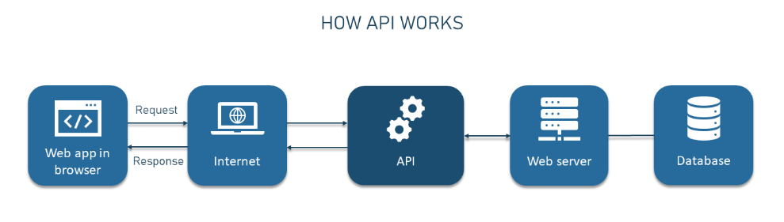

## What are APIs?

**API**, stands for **Application Programming Interface**, is a set of rules and protocols that allows different software applications to communicate with each other. 

### How are APIs Used?

APIs are used in a variety of ways to enable different software components and services to work together:

- **Data Retrieval**: APIs fetch data from remote sources. 
- **Integration**: APIs connect different apps.  
- **Automation**: APIs automate tasks between apps.  
- **Customization**: APIs extend app features.  

### Why APIs Are Popular:

- **Modularity**: APIs break software into manageable parts, simplifying maintenance.

- **Reusability**: Developers reuse APIs, saving time and effort.

- **Scalability**: APIs help apps interact with external resources, aiding scalability.

- **Ecosystem Growth**: APIs foster developer communities and innovation.

- **Interoperability**: APIs make different tech work together, avoiding compatibility issues.

- **Efficiency**: APIs automate tasks, boosting efficiency and cost savings.

- **Global Connectivity**: APIs enable global data exchange and collaboration.

### Data transfer process in API communication.

### What is a REST API? 

A REST API, or **Representational State Transfer Application** **Programming Interface**, is a set of architectural principles and constraints for designing networked applications. 

RESTful APIs simplify development and promote scalability and flexibility.

### What makes an API RESTful?

To be considered RESTful, an API must adhere to certain principles and constraints:

- **Statelessness**: Each request is separate, with all needed info, and no client data is stored. 
- **Client-server Architecture**: Clients and servers are distinct, enhancing scalability and flexibility.
- **Uniform Interface**
- **Layered System**: Allows intermediaries like proxies and load balancers for scalability and security.
- **Stateless Communication**: All needed info is in each request; servers don't store client data.
- **Cacheability**: responses can be marked as cacheable, improving performance through caching.

### What is HTTP? 

HTTP stands for **Hypertext Transfer Protocol**

It's a protocol used for communication between web browsers (or other clients) and web servers.

### What is HTTPS?

HTTPS stands for **Hypertext Transfer Protocol Secure**

It's like regular HTTP but with an added layer of security. It encrypts the data exchanged between your browser and the web server, making it much harder for anyone to intercept and read sensitive information like passwords or credit card details.

### Explain HTTP request structure using the diagram provided.

diagram 1: There is a request made to the API. The verb refers to what action you would want, URL, is the location of where the data you want to receive. version refers to the version of HTTP. The header refers to the information you want to receive. Body refers to the format you want to send data. 

### Explain HTTP response structure using the diagram provided.

diagram 2: Response from API, header provides information about what the content contains, the body is the actual data. 

### What are the 5 HTTP verbs and what do they do? 

- **GET**: Used to request data from a server.
- **POST**: Used to send data to a server to create a new resource
- **PUT**: Used to update an existing resource or create it if it doesn't exist. 
- **PATCH**: Similar to PUT but used to update a part of an existing resource, rather than replacing the whole thing.
- **DELETE**: Used to request the removal of a resource on the server. 

### What is statelessness?

Statelessness, means that each interaction or request between a client and a server is independent and self-contained. 

Each request from the client to the server must contain all the necessary information for the server to understand and fulfill it. 

This approach makes systems more scalable, as servers don't need to store information about each client's history, and it ensures that requests can be processed without needing context from previous interactions.

### What is caching?

In computing, caching involves storing frequently used data or web pages in a temporary storage location (cache) so that future requests for the same data can be served faster because it doesn't need to be fetched from the original source again. 
